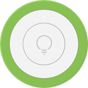
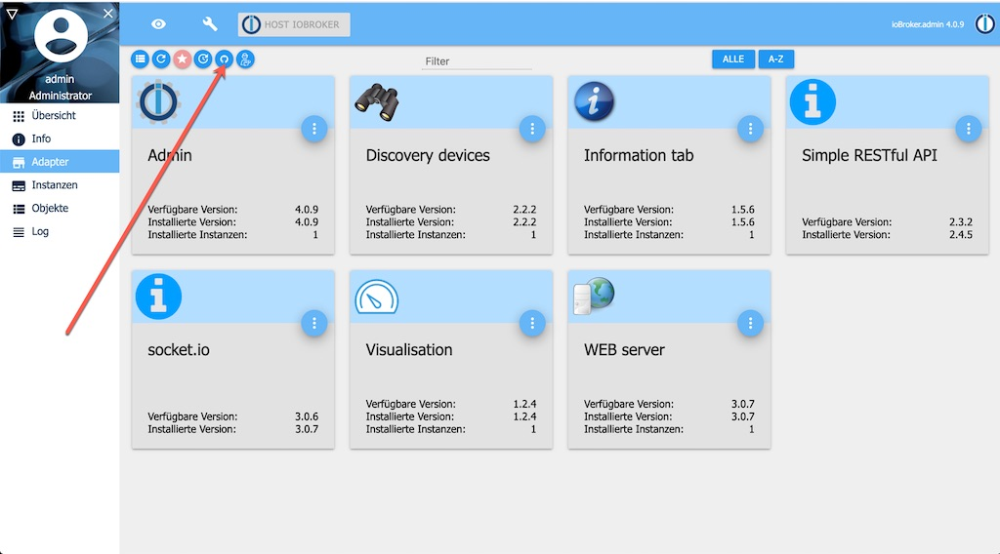
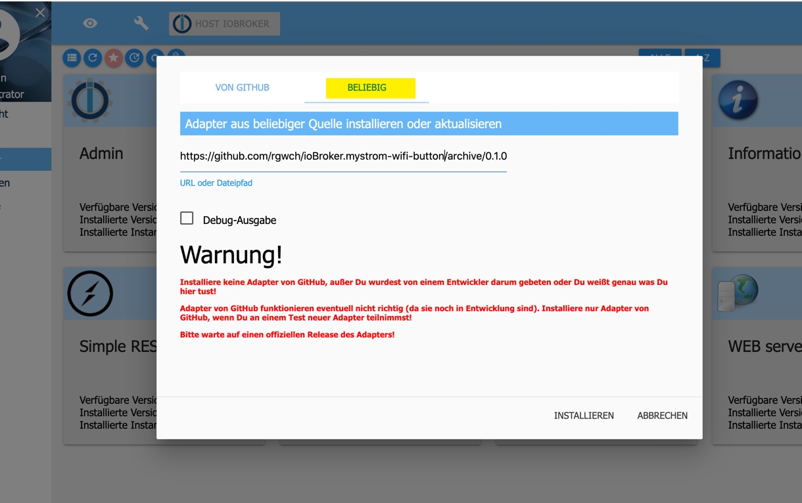
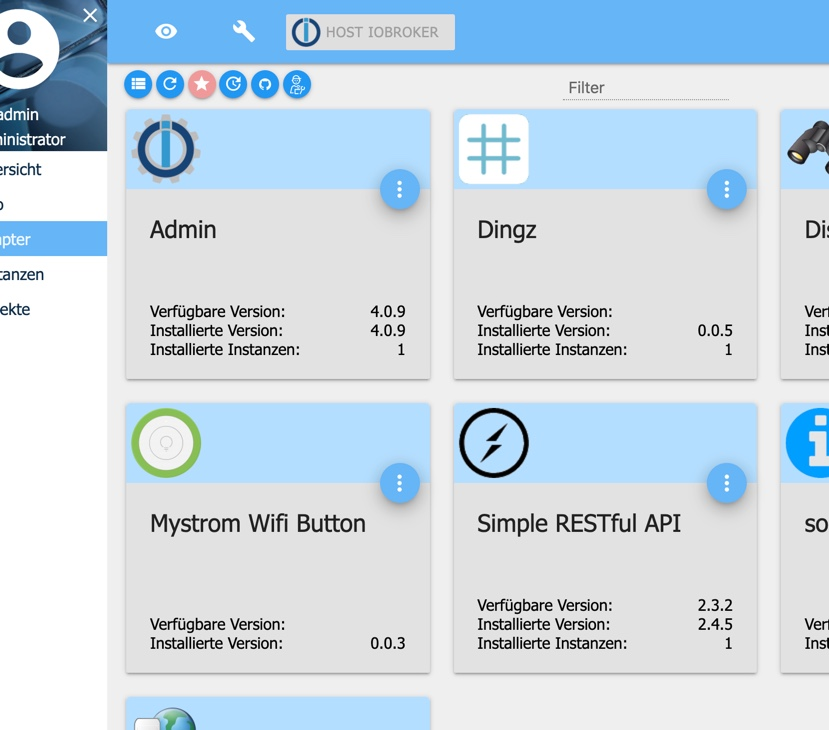
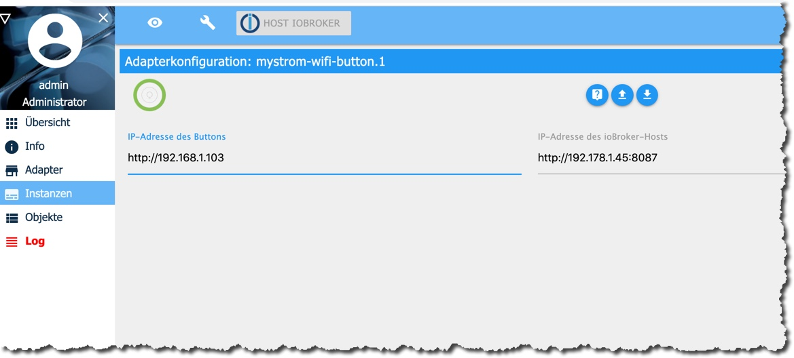

[](https://www.npmjs.com/package/iobroker.mystrom-wifi-button)
[](https://travis-ci.com/rgwch/ioBroker.mystrom-wifi-button)

# ioBroker.mystrom-wifi-button

## What it is

This is an adapter to connect [MyStrom Wifi Buttons](https://mystrom.ch/de/wifi-button/) devices with the [ioBroker](http://iobroker.net) home automation system. A Mystrom Wifi Button can send three or four different REST Calls (depending on the model), for single press, double press, long press, and touch.

With this adapter, a MyStrom Wifi Button can execute any commands in the ioBroker ecosystem.


## Software Installation

### Prerequisites

- A working instance of [ioBroker](http://www.iobroker.net). If you only want a quick test-install, I recommend using [docker](https://www.docker.com/):  
`docker run -p 8081:8081 -p 8087:8087 -p 8082:8082 --name iobroker -v iobrokerdata:/opt/iobroker buanet/iobroker:latest`

- At least the adapter "Simple RESTful API" must be installed in the ioBroker instance.

- The MyStrom Wifi Button should already be activated and connected to the WLAN (use the MyStrom App for that).

### Fetch and install ioBroker.mystrom-wifi-button

This adapter is not part of the official ioBroker distribution. So it will not show up in ioBroker admin's adapter list. You can install it either directly from NPM:

[](https://nodei.co/npm/iobroker.mystrom-wifi-button/)

or as a custom adapter from the admin-ui:



Make sure to select "Beliebig" even though it's situated on Github:



Find out the release you're interessed in: <https://github.com/rgwch/ioBroker.mystrom-wifi-button/releases> and copy/paste the address of the .tar.gz link.

Read the warning and click "install" if you agree.

The adapter should then be in the admin pages's list:



Click on the three dots near the right upper corner and then on the **+** sign in the lower left corner to create a new instance. You need a separate instance for each MyStrom Wifi Button in your Home.

The configuration dialog should open after successful creation of the instance. 

## Configuration



Connect the WiFi Button with a USB Port or a charger device. It's recommended to use the provided USB cable. Push the Button once. After a while it should become visible in the WLAN (check the router).

Enter the IP Address of the MyStrom Wifi Button. You need also to indicate the address of the ioBroker server and the port you've set when configuring the "Simple RESTful" Adapter. By default, that's 8087. You should not give the symbolic network name of the ioBroker Server, e.g. `http://homecontrol.local:8087` but instead find out the IP Address, e.g. in the router's network list (And while you're there, you'll probably want to set the DHCP server to always give the same address to this MyStrom-Wifi-Button and to the ioBroker server.)

Before pressing "save and leave" press shortly on the button to activate it. Sometimes the instance will remain "yellow". Then press again the WiFi Button and click "reload" in the instance view. If it still doesn't work, see the 'Troubleshoot'-section below.

## Use

The MyStrom-Wifi-Button adapter No. X (starting with 0) will create ioBroker states for every action:

* mystrom-wifi-button.X.single 
* mystrom-wifi-button.X.double
* mystrom-wifi-button.X.long
* mystrom-wifi-button.X.touch  (only for the model 'Button+')

Detailed informations on the MyStrom WiFi Button and its connection state are found in mystrom-wifi-button.X.info

Use the states in ioBroker Scripting or VIS UI design to react on user interactions with a controlled button (direct press or via app/web control). Example:

```javascript
const btn="mystrom-wifi-button.0."

on({id:btn+"single"},()=>{
    log("Button single press received","info")
})

on({id:btn+"double"},()=>{
    log("Button double press received","info")
})

on({id: btn+"long"},()=>{
  log("Someone pressed the Wifi Button for more than 2 seconds!","info")
  setState("tradfri.0.xyz",true)
  setState("boombox.1.volume","100%")
  setState("musicbox.songselect","beethoven 5")
  // Play for 1 minute
  setTimeout(()=>{
    setState("tradfri.0.xyz",false)
    setState("boombox.1.volume","20%")
    setState("musicbox.songselect","")
  },60000)
})
```

## Troubleshoot
MyStrom WiFi Button needs quite a strong WLAN and disconnects itself after a short delay. If disconnected, ioBroker can not find it for configuration. Configuration is only possible, wenn the Button is connected to a USB port. (The Button+ enters configration mode, if you remove and reinsert batteries).

If the indicator in the instances tab doesn't turn green:

* make sure, you gave the correct IP Address of the button. Use a Browser and navigate to `http://{IP of the button}/api/v1/info`. If that call doesn't succeed, you have either the wrong IP or the Button doesn't work. If you receive a JSON Data Structure, the Button is alive. Try to reload the Adapter instance.

* Check the entries in the "Log" Tab of ioBroker. If it says "ETIMEDOUT" or "EHOSTUNREACH", the Button was not found. Disconnect and reconnect from the USB and press the Button. Try to find it with the browser.  If t says something like "Only absolute URLs are supported", you had probably a typo in the URL.


## Changelog

### 0.1.2
* (rgwch) Small Bugfixes
* (rgwch) Corrected documentation

### 0.1.0
* (rgwch) initial release

## License
MIT License

Copyright (c) 2020 rgwch <rgw@rgw.ch>

Permission is hereby granted, free of charge, to any person obtaining a copy
of this software and associated documentation files (the "Software"), to deal
in the Software without restriction, including without limitation the rights
to use, copy, modify, merge, publish, distribute, sublicense, and/or sell
copies of the Software, and to permit persons to whom the Software is
furnished to do so, subject to the following conditions:

The above copyright notice and this permission notice shall be included in all
copies or substantial portions of the Software.

THE SOFTWARE IS PROVIDED "AS IS", WITHOUT WARRANTY OF ANY KIND, EXPRESS OR
IMPLIED, INCLUDING BUT NOT LIMITED TO THE WARRANTIES OF MERCHANTABILITY,
FITNESS FOR A PARTICULAR PURPOSE AND NONINFRINGEMENT. IN NO EVENT SHALL THE
AUTHORS OR COPYRIGHT HOLDERS BE LIABLE FOR ANY CLAIM, DAMAGES OR OTHER
LIABILITY, WHETHER IN AN ACTION OF CONTRACT, TORT OR OTHERWISE, ARISING FROM,
OUT OF OR IN CONNECTION WITH THE SOFTWARE OR THE USE OR OTHER DEALINGS IN THE
SOFTWARE.

## More like this

* [MyStrom WiFi Switch](http://github.com/rgwch/ioBroker.mystrom-wifi-switch)
* [Dingz](http://github.com/rgwch/ioBroker.dingz)
